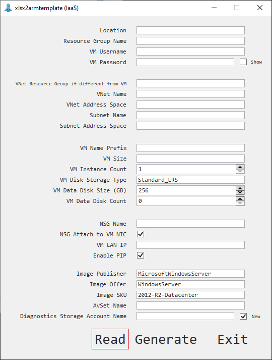
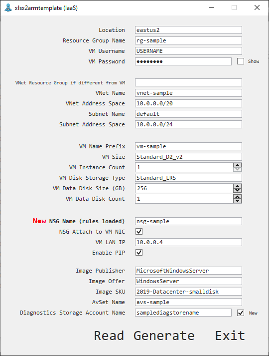
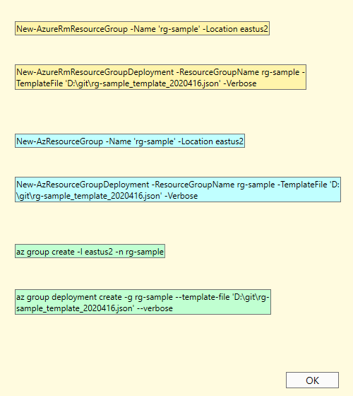

# Xlsx-to-AzureRM-Template-VM

Read from a Excel file and generate Azure ARM template for VM provisioning.

This program is suggested to be used only if you have certain knowledges of Azure VM and it can simpify the creation of Azure VM(s) with most common options / properties.

It does not create Azure VM directly, it only generates an ARM template based on your inputs.

## Prerequests

* An valid Azure subscription;

* Have the basic concept of how to create Azure VM(s).

## How to
* Fill in the D column of the *Resource List Template and Sample.xlsx* or *Resource List Template and Sample China.xlsx* if you are looking to create VM on Azure China;

* Other columns of the xlsx is ignored, the program only reads D column;

* Close the Excel file;

* Launch *XLSX_to_ARMTemplate_IAAS.exe*;

* Click **Read**; choose your xlsx file;

* Click **Generate**;

* Log in your Azure account and make sure the correct context / subscription is chosen in your terminal (AZ Cli / AzureRm Powershell / Az pwsh);

* Click the upper promoted command to create a Resource Group if required, paste to your terminal to execute; click the lower promoted command to make a new ARM deployment using the generated template file

## Resources and properties covered (ARM only)

Virtual Machine (multiple VM instances creation capable)

Virtual Network

Data Disk (Managed Disk only)

Network Security Group

Network Interface

Public IP

Availability Set

Diagnostic Account (no Application Insight support for now)

## Xlsx file instructions

* Only Column D is useful, contents in other columns will be ignored;

* You can change any value in the program if needed and the ARM template will be generated based on the value in the program;

* Due to the UI limitation, you cannot edit NSG Rules in the program, NSG Rules can only be read from Excel file(s);

* I am too lazy to implement the reading function in a more flexable way, so please keep the rows and orders as is, it only reads this very fixed order;

* The *Subscription* row is ignored, just for users' reference;

* If the VNet you are looking to have your VM(s) created in is in a different Resource Group, then please fill the *VNet Resource Group (If different from VM)* row, and I assume you have the VNet created already before create VM(s); VNet will not be created VNet if it is in a different Resrouce Group;

* For VNet in the same Resource Group of the VM(s), fill in *VNet Address Space* will create new VNet, leaving it blank will assume the VNet and subnet already exist;

* If you are looking to create just 1 VM, the name of the VM will be the value of the *VM Name Prefix* (e.g. MyVM), if multiple VMs are to be created, a number start from 1 will be appended to the prefix (e.g. MyVM1, MyVM2, MyVM3, ...);

* If you have 0 in either *VM Data Disk Size (GB)* or *VM Data Disk Count*, no data disk will be created;

* If you have values in the NSG Rules sheet, a new NSG with rules will be created; if you wish to use an existing NSG, please remove the NSG Rules sheet or it will overwrite your exiting NSG;

* If you choose NSG attach to VM NIC, it will be attached to NIC, other options will leave it as is, meaning you will have to manually attach to a subnet or Load Balancer.

## Program instructions

* Tick *New* next to *Diagnostic Storage Account Name* to create new Storage Account, untick it to use an existing Storage Account.

